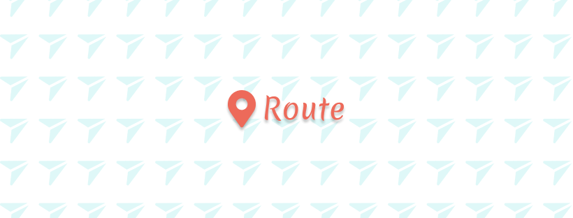
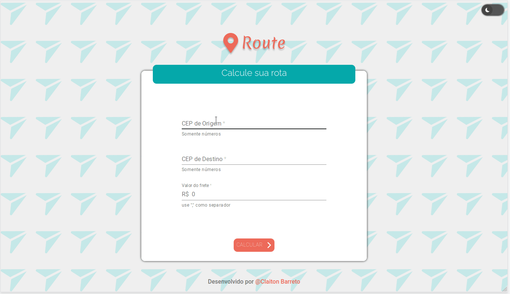



    
    <i><b>A simple app to calculate distance, freight and route details between two postal codes</b></i>

 

 &nbsp;

 

 <a href="#about">About</a> •
 <a href="#features">Features</a> •
 <a href="#techs">Used Techs</a> •
 <a href="#author">Author</a> 

 

### ☑ Features {:id="features"}

- [x] Search and show Brazilian Postal Codes 
- [x] Show Distance and avegare time for route
- [ ] Save favorites routes
- [ ] Auto-complete adress

 

### 🎥 Preview

 

### 🔨 Used Techs {:id="techs"}

 And more... 

 

### ✍🏾 Author {:id="author"}

Claiton Barreto

<b>Talk with me!</b>

 

  